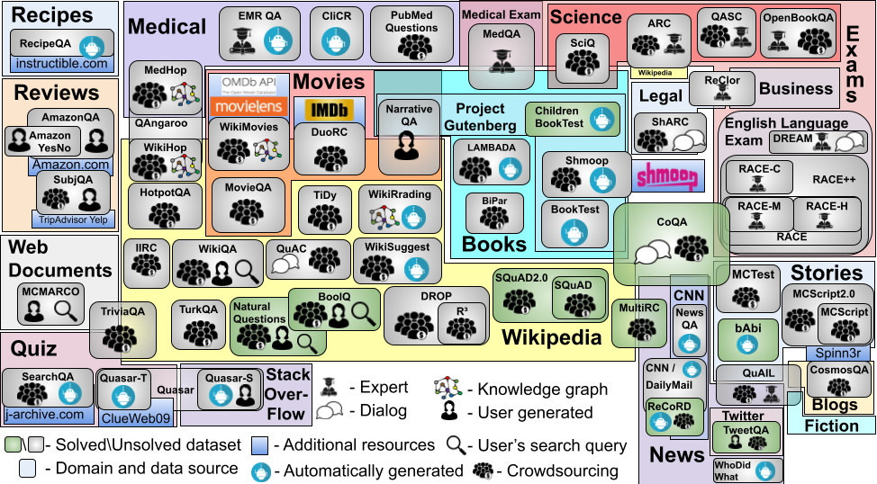

## Welcome to English Machine Reading Comprehension Datasets

<!-- You can use the [editor on GitHub](https://github.com/DariaD/RCZoo/edit/master/README.md) to maintain and preview the content for your website in Markdown files.

Whenever you commit to this repository, GitHub Pages will run [Jekyll](https://jekyllrb.com/) to rebuild the pages in your site, from the content in your Markdown files.

### Markdown

Markdown is a lightweight and easy-to-use syntax for styling your writing. It includes conventions for

```markdown
Syntax highlighted code block

# Header 1
## Header 2
### Header 3

- Bulleted
- List

1. Numbered
2. List

**Bold** and _Italic_ and `Code` text

[Link](url) and 
```

For more details see [Basic writing and formatting syntax](https://docs.github.com/en/github/writing-on-github/getting-started-with-writing-and-formatting-on-github/basic-writing-and-formatting-syntax).

### Jekyll Themes

Your Pages site will use the layout and styles from the Jekyll theme you have selected in your [repository settings](https://github.com/DariaD/RCZoo/settings/pages). The name of this theme is saved in the Jekyll `_config.yml` configuration file.

### Support or Contact

Having trouble with Pages? Check out our [documentation](https://docs.github.com/categories/github-pages-basics/) or [contact support](https://support.github.com/contact) and we’ll help you sort it out.
-->




## Citation

If you find an information on this page usefull or use any code from this repository, please cite our  paper [English Machine Reading Comprehension Datasets: A Survey](https://aclanthology.org/2021.emnlp-main.693/):

```
@inproceedings{dzendzik-etal-2021-english,
    title = "{E}nglish Machine Reading Comprehension Datasets: A Survey",
    author = "Dzendzik, Daria  and
      Foster, Jennifer  and
      Vogel, Carl",
    booktitle = "Proceedings of the 2021 Conference on Empirical Methods in Natural Language Processing",
    month = nov,
    year = "2021",
    address = "Online and Punta Cana, Dominican Republic",
    publisher = "Association for Computational Linguistics",
    url = "https://aclanthology.org/2021.emnlp-main.693",
    doi = "10.18653/v1/2021.emnlp-main.693",
    pages = "8784--8804",
    abstract = "This paper surveys 60 English Machine Reading Comprehension datasets, with a view to providing a convenient resource for other researchers interested in this problem. We categorize the datasets according to their question and answer form and compare them across various dimensions including size, vocabulary, data source, method of creation, human performance level, and first question word. Our analysis reveals that Wikipedia is by far the most common data source and that there is a relative lack of why, when, and where questions across datasets.",
}
```


## Get Started with code
Attention: 

This project contains the code to process a number of datasets but does does not contains the datasets itselfs. 
To proceed with the processing, you should download a dataset yourself and set up paths in parameters.py


### Step 1: Preparation
 Get ready your python environment, create a new one if you need (recommended).
 
 Download or get ready a dataset for processing.
 
### Step 2: Paths
 Set up your paths in the `parameters.py` file.
 
 To do so you need to specify the following: 
 
 `data_folder` is your primary folder for storage the datasets
 
 `result_folder` is your primary folder for result of processing. For every datasete there will to be a new folder created.
 The default `result_folder = _RC_ZOO_RESULT_`  
 
 
 Make sure you specify name and paths to the datasets 


### Step 3: Process individual datasets
To process one dataset run:

 ```
 python3 run_datasets.py --task_name=[TASK_NAME] --debug_flag=[True/False] --light=[True/False]

 ```
 
 Where:
 
 `task_name` is the name of the dataset, see all available for precessing datasets in the `parameters.py` file.
 
 `debug_flag` (default=`False`) is boolean flag, if true then process only one example form the file. 
 The result would be saved into `result_folder\[dataset_name]\debug`
 
 `light` (default=`True`) is boolean flag. if true then *do not* save the result of stanza processing. 
 Be aware, if `light=False` the processed data might take a significant amount of memory on your hard drive.
 

 To process all datasets or subset of datasets you can use `run.sh`. Make sure you listed the datasets in the file. 
     
The result for each dataset will be saved to your `result_folder\[dataset_name]`.
It will contain the following files: 
dataset statistic (`statistics.txt` and `statistics.json`), 
vocabulary of the dataset in `vocabulary.txt`,
list of all questions `questions.txt`,
list of all answers `answers.txt`,
folder with dataset instances for manual examination (empty if `light` = `True`), 
and folder with named entities 

Example of output:

```

-------_start new dayaset ----------------
Dataset: mctest160
        Data collected
        The debug is False
The number of examples is: 160
Number of examples: 160
Len currupted: 0
Len invalid: 0
Complete successfully!
##########################

```

There are a number of dataset which are not a pert of the standard processing 
(ARC, WikiQA, WikiReading, NaturalQuestions, and Lambada)
There are a separate individual scripts for processing those datasets. 

<!--## Step 4. Aggregation of Results

There are a number of scripts for further results aggregation.
-->

 